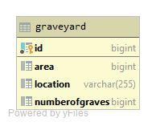

# 01-assignment-quarkus-jpa-ThomasAnt

# Deployment

+ start postgres in docker
  + docker run --name postgres -p 5432:5432 -e POSTGRES_PASSWORD=passme postgre
+ start quarkus application
  + mvn quarkus:dev
  + oder in der IDE

# ERD

